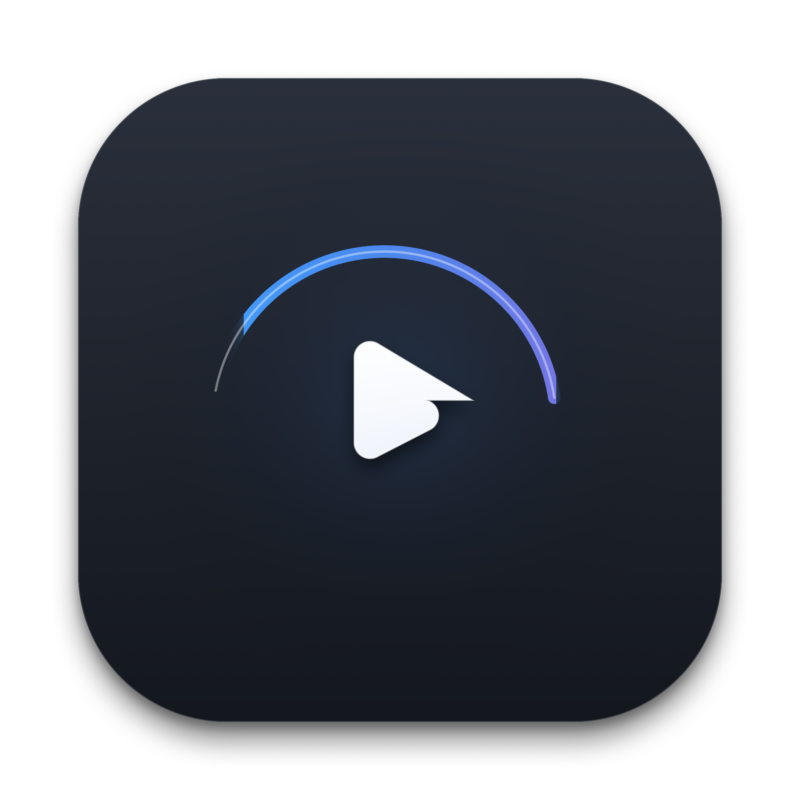
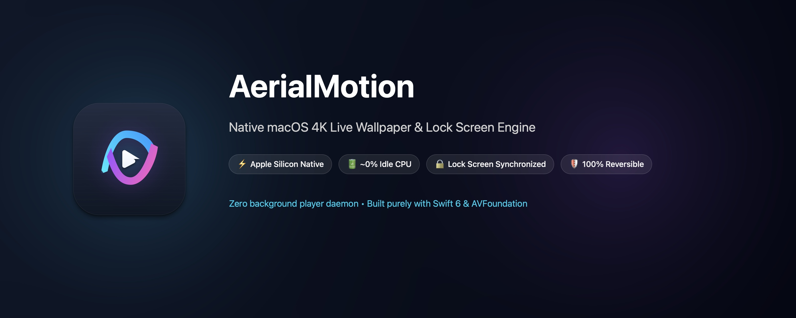
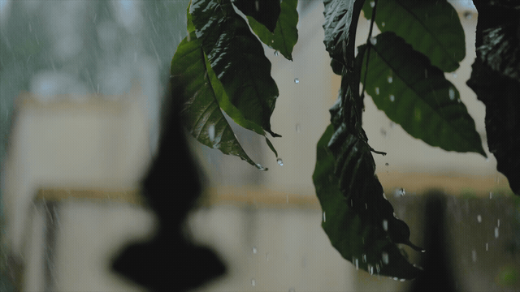
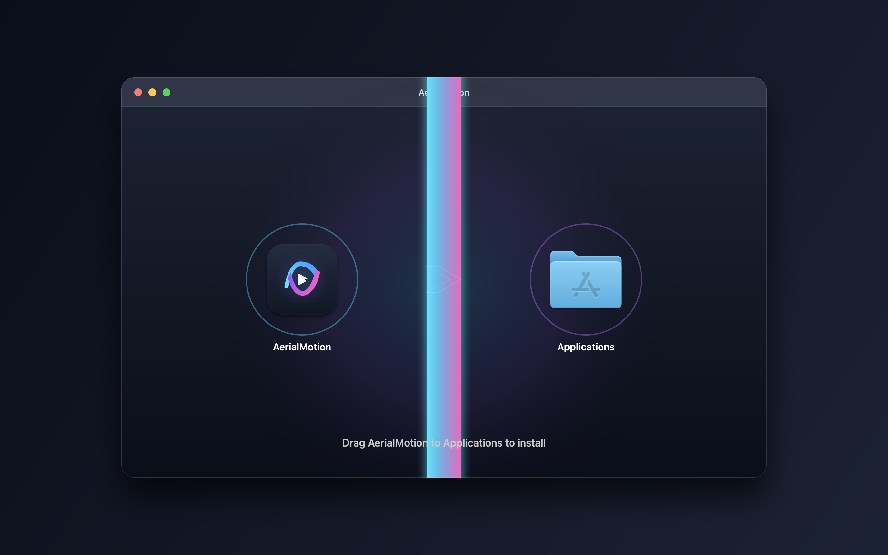

<p align="center">
  
</p>

<h1 align="center">AerialMotion</h1>

<p align="center">
  <strong>Set any <code>.mp4</code> or <code>.mov</code> video as your native macOS desktop AND lock screen wallpaper.</strong>
  <br />
  <em>Native Swift 6 • Zero background daemon • Zero battery drain • ~0% idle CPU</em>
</p>

<p align="center">
  <a href="https://github.com/imsachink/AerialMotion/releases/latest/download/AerialMotion.dmg"></a>
  <a href="#-requirements"></a>
  <a href="#-architecture"></a>
  <a href="#-performance--resource-usage"></a>
  <a href="https://buymeacoffee.com/sachinkaundal"></a>
  <a href="LICENSE"></a>
</p>

<p align="center">
  
</p>

<p align="center">
  
  <br />
  <sub>🌧️ <em>Workflow: Click menu to choose video ➔ Select file & click Open ➔ Instant desktop live motion ➔ Seamless lock screen sync • Footage from <a href="https://www.pexels.com/video/shallow-focus-of-green-leaves-wet-with-rain-5487781/">Pexels</a> (<a href="https://www.pexels.com/download/video/5487781/">Download Video</a>) • <a href="assets/demo.mp4">▶ Watch Full HD 1080p Video</a></em></sub>
</p>

---

## 💡 Why AerialMotion?

Most live wallpaper apps for macOS run a continuous video playback loop in the background, constantly consuming **15%–40% CPU**, spinning fans, and draining battery. Moreover, third-party apps cannot touch the macOS lock screen.

**AerialMotion takes a fundamentally different approach:**
Instead of running a background player, it integrates your video directly into macOS's native Aerial wallpaper engine (`WallpaperAgent`).

* ⚡ **macOS handles playback natively** using Apple Silicon dedicated media engines.
* 🔒 **Seamless lock screen & desktop synchronization** — when you wake or lock your Mac, the video transitions fluidly just like Apple's official Aerial wallpapers.
* 🔋 **~0% idle CPU** — the menu bar companion uses no background resources when idle.
* 📦 **Zero external dependencies** — built with Apple's native **AVFoundation** and Cocoa frameworks. No Homebrew or external tools required.
* 🛡 **100% reversible** — restore Apple's default wallpapers at any time with one click.

### 📊 How AerialMotion Compares

| Feature | AerialMotion | Traditional Mac Wallpaper Apps |
| :--- | :---: | :---: |
| **Lock Screen Support** | **✅ Yes (Native Apple Aerial)** | ❌ Desktop only |
| **Idle CPU Usage** | **⚡ ~0% (No background player)** | ⚠️ 15% – 35% constant drain |
| **Battery Impact** | **🔋 Near-Zero (Hardware accelerated)** | ⚠️ Heavy battery drain |
| **Mission Control Spaces** | **✨ Seamless (No visual glitches)** | ❌ Stuttering window overlays |
| **System Integration** | ** Native macOS Aerial Engine** | Hacky borderless window |
| **Cost & License** | **🎁 100% Free & Open Source (MIT)** | $2.99 – $9.99 / Paid Subscriptions |

---

## ✨ Features

- **1-Click Picker & Drag-and-Drop**: Click the drop zone to open the native macOS file picker (`⌘N`) or simply drag and drop any `.mp4`, `.mov`, or `.m4v` video.
- **Lock Screen & Desktop Sync**: Both display the exact same video asset, synchronized seamlessly.
- **Continuous Desktop Live Motion**: Optional continuous live video playback on your Home Screen / Desktop.
- **Ultra-Low Battery Saver (Wallspace-Style)**:
  - 🔋 **Pause on Battery**: Pauses desktop motion automatically when running on MacBook battery to preserve runtime.
  - ⚡ **Low Power Mode**: Automatically pauses when macOS Low Power Mode is engaged.
  - 🪟 **Desktop Occlusion Sensing**: Drops to 0% CPU/GPU whenever full-screen windows or apps cover the desktop.
  - 💤 **Sleep & Lock Sleep**: Pauses instantly when display sleeps or locks.
- **1-Click In-App Auto-Updates**: Installs new versions directly in-app and relaunches automatically — zero browser navigation required.
- **Hardware-Accelerated Ingestion**: Remuxes video tracks natively with 2-layer hierarchical HEVC encoding and zero CPU overhead.
- **Custom Wallpaper Library**: Saves your favorite video wallpapers with quick 1-click switching.
- **Sleek Menu Bar Experience**: Glassmorphic SwiftUI interface with right-click menu, monochrome toggle, and global shortcuts.
- **Safe State Rollback**: Restore Apple default wallpapers at any time with one click.

---

## 📋 Release Notes & Changelog

AerialMotion follows [Semantic Versioning](https://semver.org/). See the complete [CHANGELOG.md](CHANGELOG.md) for full version history.

| Version | Highlights | Status |
| :---: | :--- | :---: |
| **v1.1.1** | **1-Click Native File Picker** (`⌘N` or click anywhere on drop zone), proper Dock/Finder window layer ordering (`-2147483604`), and instant popover sizing. | **Latest Release** |
| **v1.1.0** | **Continuous Desktop Live Motion** (`AVPlayerLayer`), Wallspace-style multi-tier **Battery Saver** (Pause on Battery, Low Power Mode, Window Occlusion Sensing), and direct **In-App Auto-Updater**. | Stable |
| **v1.0.1** | Dual-layer hierarchical HEVC remuxing (`temporal_id=0/1`), Mission Control multi-space fix, and status bar context menu. | Archived |
| **v1.0.0** | Initial public launch: native macOS Sonoma/Sequoia lock screen and desktop video injection. | Archived |


## 📋 Requirements

1. **macOS 14 (Sonoma), 15 (Sequoia), or newer**
2. **One official Apple Aerial wallpaper downloaded**:
   * Open **System Settings** → **Wallpaper**.
   * Click on any aerial video wallpaper (e.g., *Tahoe*, *Sonoma*, *Yosemite*) and let macOS download it once. This initializes Apple's local wallpaper asset catalog.

> [!NOTE]
> **No external dependencies needed!** Video remuxing and thumbnail extraction are handled natively via Apple's built-in `AVFoundation` and `/usr/bin/avconvert`.

---

## 📥 Download & Install (Easy Way)

1. Download **[AerialMotion.dmg](https://github.com/imsachink/AerialMotion/releases/latest/download/AerialMotion.dmg)** (Direct Download) or view [All Releases](https://github.com/imsachink/AerialMotion/releases).
2. Double-click the `.dmg` — a custom installer window will appear:
   <p align="center">
     
   </p>
3. Simply drag **AerialMotion** into the **Applications** shortcut.
4. Open **AerialMotion** from Launchpad or Spotlight. It sits quietly in your top menu bar.

> [!IMPORTANT]
> **First Launch on macOS (Gatekeeper Quarantine):**  
> Because AerialMotion is an independent open-source project without a paid corporate Apple Developer certificate, macOS Sequoia / Sonoma may prompt about untrusted downloads.  
> To open the app immediately, run this one-line command in your **Terminal**:
> ```bash
> xattr -cr /Applications/AerialMotion.app
> ```
> *(Or right-click `AerialMotion.app` in Finder, hold `Option`, and select **Open** → **Open Anyway**).*

---

## 🚀 How to Use

1. Click the **AerialMotion** icon in your top menu bar.
2. **Click the drop zone** (or press `⌘N`) to pick a video file, or **drag and drop** any `.mp4` or `.mov` file directly onto the card.
3. Your video becomes your active desktop and lock screen wallpaper instantly!
4. Press `⌃ + ⌘ + Q` (Lock Screen) to enjoy seamless lock-screen playback.

---

## 🎬 Where to Find Great 4K Wallpapers

You can use any video file, but slow-motion, drone, or ambient loop videos look the most stunning as aerial wallpapers:

* **[Pexels Videos](https://www.pexels.com/videos/)** — High-quality free 4K drone, nature, and aerial footage.
* **[Pixabay](https://pixabay.com/videos/)** — Royalty-free 4K/UHD nature, landscape, and city loops.
* **[r/cinemagraphs on Reddit](https://www.reddit.com/r/cinemagraphs/)** — Beautiful seamless loop animations.
* **[Mixkit](https://mixkit.co/free-stock-video/)** — Free atmospheric landscapes and scenic video clips.

---

<details>
<summary>🛠 <strong>Developers: Build from Source</strong></summary>

```bash
git clone https://github.com/imsachink/AerialMotion.git
cd AerialMotion

# Build and install directly to /Applications
make install

# Or create a standalone DMG
make dmg
```

| Command | Action |
|---|---|
| `make app` | Assembles the standalone `AerialMotion.app` bundle |
| `make dmg` | Packages `AerialMotion.dmg` for distribution |
| `make install` | Builds the app, copies to `/Applications`, and launches it |
| `make clean` | Removes `.build` artifacts and generated DMGs |

</details>

---

## ❓ FAQ & Troubleshooting

### Why is my lock screen black while the desktop works?
Make sure you have downloaded at least one official aerial wallpaper in **System Settings → Wallpaper**. macOS needs Apple's baseline cache initialized before it can play custom lock screen assets.

### Do I need to install `ffmpeg` or Homebrew?
**No.** AerialMotion has zero required external dependencies. It uses Apple's native **AVFoundation** and macOS's pre-installed `/usr/bin/avconvert` utility. (If you happen to already have `ffmpeg` installed, AerialMotion will opportunistically use it for stream-copying, but it is purely optional.)

### How do I revert back to default Apple wallpapers?
Click the gear icon (⚙️) in the AerialMotion menu bar window and select **Restore Apple Originals**.

---

## ⭐ Support the Project

If AerialMotion made your Mac desktop and lock screen look better, please consider giving this repository a **Star (⭐)** or buying me a coffee! It helps keep the project 100% free, ad-free, and actively maintained.

<p align="left">
  <a href="https://buymeacoffee.com/sachinkaundal" target="_blank">
    
  </a>
</p>

---

## 👤 Author

Developed by **Sachin Kaundal** ([@imsachink](https://github.com/imsachink)).

---

## 📄 License

Distributed under the MIT License. See `LICENSE` for more information.
